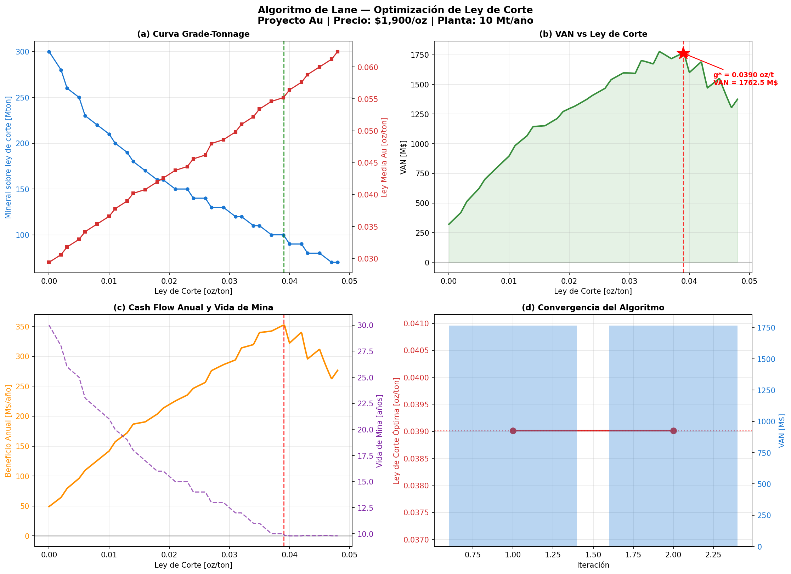

# Algoritmo de Lane — Optimización de Ley de Corte

Implementación del **Algoritmo de Lane** para determinar la ley de corte óptima en proyectos mineros de oro, maximizando el Valor Actual Neto (VAN) del yacimiento.



---

## Descripción

El Algoritmo de Lane es un método iterativo clásico de optimización minera que considera simultáneamente las tres restricciones de capacidad de un proyecto:

| Capacidad | Descripción |
|-----------|-------------|
| **Mina (M)** | Toneladas de material total movido por año |
| **Planta (H)** | Toneladas de mineral procesado por año |
| **Mercado (K)** | Onzas de metal vendibles por año |

## Observación
* El script está en proceso de mejora, buscando generalizarlo para la evaluación economica de proyectos que exploten otros metales de manera individual o que sean polimetalicos.
* El resultado de la Ley de corte óptima de Lane (0.039015 oz/ton) fue validada por otro profesional, sin embargo las ecuaciones de las leyes break-even serán revisadas en una siguiente versión para asegurar que sus cálculos esten correctos para ser usados en otros datasets.
* Una próxima versión del script será capaz de leer los datos de entrada (tabla tonne/grade, parametros economicos y de capacidad) desde un archivo separado, evitando tener que "hardcodear" los datos en el mismo script.
---

## Estructura del Proyecto

```
├── lane_algorithm_3.py     # Script principal con todo el algoritmo
├── tongrade_lane1.csv      # Tabla Grade/Tonnage del yacimiento (datos de entrada)
├── lane_results.png        # Panel de resultados (generado al ejecutar)
└── .gitignore
```

---

## Parámetros Económicos del Caso Base

| Parámetro | Valor | Unidad |
|-----------|-------|--------|
| Precio Au (`p`) | 1,900 | $/oz |
| Costo de venta (`s`) | 45 | $/oz |
| Costo de procesamiento (`h`) | 37 | $/ton ore |
| Costo de mina (`m`) | 3.9 | $/ton material |
| Costos fijos (`f`) | 8.35 | M$/año |
| Recuperación metalúrgica (`y`) | 90 | % |
| Capacidad de molienda (`H`) | 10 | Mt ore/año |
| Capacidad de mina (`M`) | 50 | Mt material/año |
| Tasa de descuento (`d`) | 15 | % |

---

## Requisitos

```bash
pip install numpy pandas scipy matplotlib
```

---

## Uso

```bash
# Usando el CSV incluido (tongrade_lane1.csv)
python lane_algorithm_3.py

# Usando un CSV personalizado
python lane_algorithm_3.py --csv mi_tabla_grade_tonnage.csv
```

### Formato del CSV de entrada

El archivo CSV debe contener las siguientes columnas:

```
Cut off (Oz/ton), Mineral (Mton), Au (Oz/ton), REM
```

Donde `REM` es la razón estéril/mineral (Stripping Ratio).
---

## Salidas

El script genera:

- **Consola**: tabla de iteraciones con `g*`, tonelaje, ley media, REM, vida de mina, beneficio anual y VAN.
- **`lane_results.png`**: panel de 4 gráficos:
  - (a) Curva Grade-Tonnage
  - (b) VAN vs Ley de Corte
  - (c) Cash Flow Anual y Vida de Mina
  - (d) Convergencia del algoritmo
- **`lane_sensitivity.csv`**: análisis de sensibilidad completo (500 puntos de corte evaluados).

---

## Metodología

1. **Interpolación** de la curva Grade-Tonnage: `T(g)`, `Q(g)`, `REM(g)`
2. **Leyes de break-even** para cada par de capacidades (`g_mh`, `g_hk`, `g_mk`)
3. **Iteración de Lane**: para cada candidato `g`, se calcula el beneficio anual y el VAN incluyendo el costo de oportunidad `F`
4. **Selección por mediana** de los tres óptimos parciales
5. **Convergencia** cuando `|g*_nueva − g*_anterior| < 1e-6`

---

## Contexto Académico

Desarrollado buscando automatizar la aplicación del algoritmo de Kenneth Lane para la optimización de leyes de corte, acelerando la evaluación económica de proyectos mineros

---

## Referencia

Lane, K.F. (1988). *The Economic Definition of Ore: Cut-off Grades in Theory and Practice*. Mining Journal Books, London.
